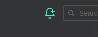
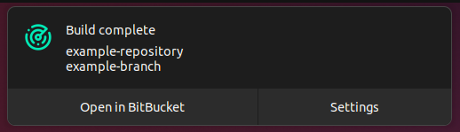
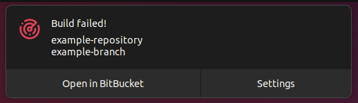
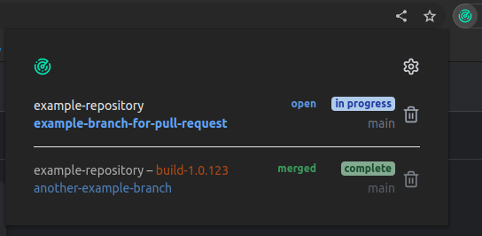

# Build Alerts for BitBucket

> This project has been made for a specific work environment. You might not be able to use it directly as is.

This is a browser extension which adds a button on a BitBucket PR pages:

Click this button when your PR is ready to be merged and deployed. You will be notified when your build succeeds or fails:

Then once the PR is merged, you will be notified when the corresponding build on the main branch complete.

The extension's dialog lists the PRs your are receiving notifications for:

## Installation

### Chrome

- run `npm run build`,
- open `chrome://extensions`,
- activate `Developer mode`,
- click `Load unpacked` and open the `dist` folder created by the build command.

### Firefox

- run `npm run pack:firefox`,
- use the the Developer or Nightly edition of Firefor,
- open `about:config` and set `xpinstall.signatures.required` to `false`,
- open `about:addons`,
- click the cog wheel, `Install Add-on From File...`, and select the `xpi` file present in the `dist` folder created by the build command,
- (optional) reopen `about:config` and set `xpinstall.signatures.required` back to `true`.
